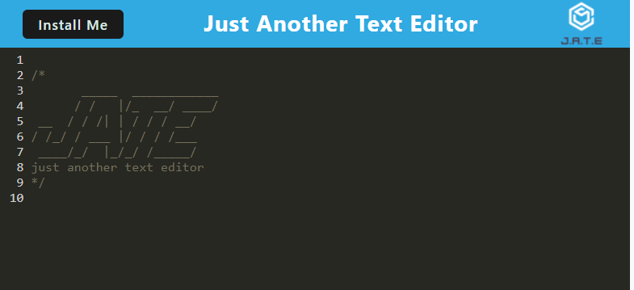

# JATE - Text Editor

## Description
This is a text editor app that will run in the browser, save data to a IndexedDB database, cache data for offline use, and can be installed as a PWA (Progressive Web App) on your phone or computer.  
I had some difficulty with the app caching, and having to refresh the page to get the proper content. I also had an issue displaying the icon, and learned about 'finerprints' in the manifest.json. I had to stop the hashing of the image file name when bundling, so the browser would be able to find the image file. This was not necessary for any of our class activities so I am still not sure why it was necessary here, but it works and I learned something in the process.  The app is deployed, but I do find sometimes I had to clear the cache and refresh the page in order to clear the console of errors and display the install button.
This is my first attempt at building a PWA, and I am happy with the results. I learned a lot about IndexedDB and caching, and I am excited to learn more about PWAs.

## Table of Contents

- [Installation](#Installation)
- [Usage](#Usage)
- [Credits](#Credits)
- [License](#License)
- [Contributing](#Contributing)
- [Tests](#Tests)
- [Questions](#Questions)  

## Installation
To install this app as a PWA, click on the install button in the header of the app and follow the prompts. You must be connected to the internet to install.
To install the [repo](https://github.com/milena-allaway/text_editor), clone it, then run `npm install` to install the dependencies, then run `npm start` to build the app and start the server.

## Usage
To use this app, simply type in the text area. The app will automatically save your work to the database. You can add or delete text, and the app will save your changes. You can also use the app offline. It can be installed on your phone or computer or used in the browser. You can visit the deployed app [HERE](https://text-editor-tcmj.onrender.com)
  

## Credits
The class activities and lessons were a good guide in building this app. My instructor Edward Apostole was very helpful in helping me get a better understanding of some concepts. I also used the following resources:
* https://stackoverflow.com/questions/72343203/how-to-add-custom-install-button-for-pwa
* https://web.dev/articles/customize-install
* https://coding-boot-camp.github.io/full-stack/render/render-deployment-guide
* https://developer.chrome.com/docs/workbox/modules/workbox-webpack-plugin/
* https://web.dev/articles/runtime-caching-with-workbox
* https://www.npmjs.com/package/webpack-pwa-manifest
* https://developer.mozilla.org/en-US/docs/Web/API/IndexedDB_API#examples
* https://www.npmjs.com/package/idb

## License
This project is licensed under the [MIT License](https://opensource.org/licenses/MIT)  

## Contributing
Create an issue in [my repo](https://github.com/milena-allaway/text_editor/issues)

## Tests
N/A. No tests are included in this app.

## Questions
For any questions or feedback, please contact me via:
- [GitHub](https://github.com/milena-allaway)
- [Email](mailto:milenawheatcroft@gmail.com)

***

Made with ❤️ by Milena Allaway 2023
